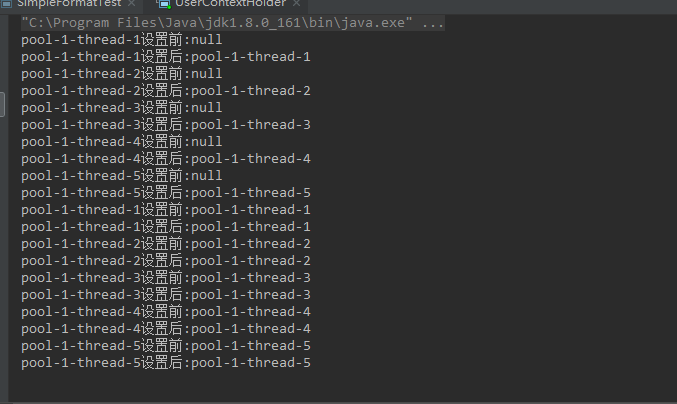
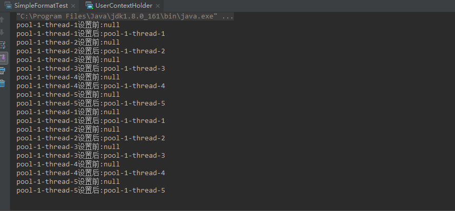

# AQS 

AQS即是AbstractQueuedSynchronizer，一个用来构建锁和同步工具的框架，包括常用的ReentrantLock、CountDownLatch、Semaphore等。

AQS没有锁之类的概念，它有个state变量，是个int类型，在不同场合有着不同含义。本文研究的是锁，为了好理解，姑且先把state当成锁。

AQS围绕state提供两种基本操作“获取”和“释放”，有条双向队列存放阻塞的等待线程，并提供一系列判断和处理方法，简单说几点：

- state是独占的，还是共享的；
- state被获取后，其他线程需要等待；
- state被释放后，唤醒等待线程；
- 线程等不及时，如何退出等待。

至于线程是否可以获得state，如何释放state，就不是AQS关心的了，要由子类具体实现。

直接分析AQS的代码会比较难明白，所以结合子类ReentrantLock来分析。AQS的功能可以分为独占和共享，ReentrantLock实现了独占功能

简单来说就是AQS维护一个state变量和一个队列（队列节点为线程相关信息），当state为0是也就是没有任何线程持有锁，当大于0时，队列中的头节点持有锁，ReentrantLock是可重入锁，利用state变量维护重入次数，当释放锁时，依次把state数值减1，直到减为0表示释放锁。

```
static final class Node {

        /**
         * The thread that enqueued this node.  Initialized on
         * construction and nulled out after use.
         */
         //线程对象
        volatile Thread thread;
        
        static final Node SHARED = new Node();
        static final Node EXCLUSIVE = null；
        static final int CANCELLED =  1;
        static final int SIGNAL    = -1;
        static final int CONDITION = -2;
        static final int PROPAGATE = -3;
        volatile int waitStatus;
        volatile Node prev;
        volatile Node next;
        Node nextWaiter;
```


# ReentrantLock

ReentrantLock的锁对象为ReentrantLock自身，不同的ReentrantLock对象为不同的锁，synchronized锁对象为类或类对象

### ReentrantLock对比synchronized

```csharp
Lock lock = new ReentranLock();
lock.lock();
try{
    //do something
}finally{
    lock.unlock();
}
```

ReentrantLock实现了Lock接口，加锁和解锁都需要显式写出，注意一定要在适当时候unlock。

和synchronized相比，ReentrantLock用起来会复杂一些。在基本的加锁和解锁上，两者是一样的，所以无特殊情况下，推荐使用synchronized。ReentrantLock的优势在于它更灵活、更强大，除了常规的lock()、unlock()之外，还有lockInterruptibly()、tryLock()方法，支持中断、超时。

### 公平锁和非公平锁

```java
public ReentrantLock() {
    sync = new NonfairSync();
}

public ReentrantLock(boolean fair) {
    sync = fair ? new FairSync() : new NonfairSync();
}
```

ReentrantLock的内部类Sync继承了AQS，分为公平锁FairSync和非公平锁NonfairSync。

- 公平锁：线程获取锁的顺序和调用lock的顺序一样，FIFO；
- 非公平锁：线程获取锁的顺序和调用lock的顺序无关，全凭运气。

ReentrantLock默认使用非公平锁是基于性能考虑，公平锁为了保证线程规规矩矩地排队，需要增加阻塞和唤醒的时间开销。如果直接插队获取非公平锁，跳过了对队列的处理，速度会更快。

### 尝试获取锁

```java
final void lock() { acquire(1);}

public final void acquire(int arg) {
    if (!tryAcquire(arg) &&
        acquireQueued(addWaiter(Node.EXCLUSIVE), arg))
        selfInterrupt();
}
```

先来看公平锁的实现，lock方法很简单的一句话调用AQS的acquire方法：

```java
protected boolean tryAcquire(int arg) {    
        throw new UnsupportedOperationException();
}
```

AQS的tryAcquire不能直接调用，因为是否获取锁成功是由子类决定的，直接看ReentrantLock的tryAcquire的实现。

```java
protected final boolean tryAcquire(int acquires) {
   final Thread current = Thread.currentThread();
   int c = getState();
   if (c == 0) {
       if (!hasQueuedPredecessors() &&
           compareAndSetState(0, acquires)) {
           setExclusiveOwnerThread(current);
           return true;
       }
   }
   else if (current == getExclusiveOwnerThread()) {
       int nextc = c + acquires;
       if (nextc < 0)
           throw new Error("Maximum lock count exceeded");
       setState(nextc);
       return true;
   }
   return false;
}
```

获取锁成功分为两种情况，第一个if判断AQS的state是否等于0，表示锁没有人占有。接着，hasQueuedPredecessors判断队列是否有排在前面的线程在等待锁，没有的话调用compareAndSetState使用cas的方式修改state，传入的acquires写死是1。最后线程获取锁成功，setExclusiveOwnerThread将线程记录为独占锁的线程。

第二个if判断当前线程是否为独占锁的线程，因为**ReentrantLock是可重入的**，线程可以不停地lock来增加state的值，对应地需要unlock来解锁，直到state为零。

如果最后获取锁失败，下一步需要将线程加入到等待队列。

### 线程进入等待队列

AQS内部有一条双向的队列存放等待线程，节点是Node对象。每个Node维护了线程、前后Node的指针和等待状态等参数。

线程在加入队列之前，需要包装进Node，调用方法是addWaiter：

```csharp
private Node addWaiter(Node mode) {
   Node node = new Node(Thread.currentThread(), mode);
   // Try the fast path of enq; backup to full enq on failure
   Node pred = tail;
   if (pred != null) {
       node.prev = pred;
       if (compareAndSetTail(pred, node)) {
           pred.next = node;
           return node;
       }
   }
   enq(node);
   return node;
}
```

每个Node需要标记是独占的还是共享的，由传入的mode决定，ReentrantLock自然是使用独占模式Node.EXCLUSIVE。

创建好Node后，如果队列不为空，使用cas的方式将Node加入到队列尾。注意，这里只执行了一次修改操作，并且可能因为并发的原因失败。因此修改失败的情况和队列为空的情况，需要进入enq。

```java
private Node enq(final Node node) {
    for (;;) {
        Node t = tail;
        if (t == null) { // Must initialize
            if (compareAndSetHead(new Node()))
                tail = head;
        } else {
            node.prev = t;
            if (compareAndSetTail(t, node)) {
                t.next = node;
                return t;
            }
        }
    }
}
```

enq是个死循环，保证Node一定能插入队列。注意到，当队列为空时，会先为头节点创建一个空的Node，因为**头节点代表获取了锁的线程**，现在还没有，所以先空着。

### 阻塞等待线程

线程加入队列后，下一步是调用acquireQueued阻塞线程。

```java
final boolean acquireQueued(final Node node, int arg) {
    boolean failed = true;
    try {
        boolean interrupted = false;
        for (;;) {
            //1
            final Node p = node.predecessor();
            if (p == head && tryAcquire(arg)) {
                setHead(node);
                p.next = null; // help GC
                failed = false;
                return interrupted;
            }
            //2
            if (shouldParkAfterFailedAcquire(p, node) &&
                parkAndCheckInterrupt())
                interrupted = true;
        }
    } finally {
        if (failed)
            cancelAcquire(node);
    }
}
```

**标记1**是线程唤醒后尝试获取锁的过程。如果前一个节点正好是head，表示自己排在第一位，可以马上调用tryAcquire尝试。如果获取成功就简单了，直接修改自己为head。这步是实现公平锁的核心，保证释放锁时，由下个排队线程获取锁。（看到线程解锁时，再看回这里啦）

**标记2**是线程获取锁失败的处理。这个时候，线程可能等着下一次获取，也可能不想要了，Node变量waitState描述了线程的等待状态，一共四种情况：

```java
 bstatic final int CANCELLED =  1;   //取消
static final int SIGNAL    = -1;     //下个节点需要被唤醒
static final int CONDITION = -2;  //线程在等待条件触发
static final int PROPAGATE = -3; //（共享锁）状态需要向后传播
```

shouldParkAfterFailedAcquire传入当前节点和前节点，根据前节点的状态，判断线程是否需要阻塞。

```java
private static boolean shouldParkAfterFailedAcquire(Node pred, Node node) {
  int ws = pred.waitStatus;
  if (ws == Node.SIGNAL)
      return true;
  if (ws > 0) {
      do {
          node.prev = pred = pred.prev;
      } while (pred.waitStatus > 0);
      pred.next = node;
  } else {
      compareAndSetWaitStatus(pred, ws, Node.SIGNAL);
  }
  return false;
}
```

- 前节点状态是SIGNAL时，当前线程需要阻塞；
- 前节点状态是CANCELLED时，通过循环将当前节点之前所有取消状态的节点移出队列；
- 前节点状态是其他状态时，需要设置前节点为SIGNAL。

如果线程需要阻塞，由parkAndCheckInterrupt方法进行操作。

```java
private final boolean parkAndCheckInterrupt() {
    LockSupport.park(this);
    return Thread.interrupted();
}
```

parkAndCheckInterrupt使用了LockSupport，和cas一样，最终使用UNSAFE调用Native方法实现线程阻塞（以后有机会就分析下LockSupport的原理，park和unpark方法作用类似于wait和notify）。最后返回线程唤醒后的中断状态，关于中断，后文会分析。

到这里总结一下获取锁的过程：线程去竞争一个锁，可能成功也可能失败。成功就直接持有资源，不需要进入队列；失败的话进入队列阻塞，等待唤醒后再尝试竞争锁。

### 释放锁

通过上面详细的获取锁过程分析，释放锁过程大概可以猜到：头节点是获取锁的线程，先移出队列，再通知后面的节点获取锁。

```cpp
public void unlock() {
    sync.release(1);
}
```

ReentrantLock的unlock方法很简单地调用了AQS的release：

```java
public final boolean release(int arg) {
    if (tryRelease(arg)) {
        Node h = head;
        if (h != null && h.waitStatus != 0)
            unparkSuccessor(h);
        return true;
    }
    return false;
}
```

和lock的tryAcquire一样，unlock的tryRelease同样由ReentrantLock实现：

```java
protected final boolean tryRelease(int releases) {
    int c = getState() - releases;
    if (Thread.currentThread() != getExclusiveOwnerThread())
        throw new IllegalMonitorStateException();
    boolean free = false;
    if (c == 0) {
        free = true;
        setExclusiveOwnerThread(null);
    }
    setState(c);
    return free;
}
```

因为锁是可以重入的，所以每次lock会让state加1，对应地每次unlock要让state减1，直到为0时将独占线程变量设置为空，返回标记是否彻底释放锁。

最后，调用unparkSuccessor将头节点的下个节点唤醒：

```csharp
private void unparkSuccessor(Node node) {
    int ws = node.waitStatus;
    if (ws < 0)
        compareAndSetWaitStatus(node, ws, 0);

    Node s = node.next;
    if (s == null || s.waitStatus > 0) {
        s = null;
        for (Node t = tail; t != null && t != node; t = t.prev)
            if (t.waitStatus <= 0)
                s = t;
    }
    if (s != null)
        LockSupport.unpark(s.thread);
}
```

寻找下个待唤醒的线程是从队列尾向前查询的，找到线程后调用LockSupport的unpark方法唤醒线程。被唤醒的线程重新执行acquireQueued里的循环，就是上文关于acquireQueued标记1部分，线程重新尝试获取锁。

### 中断锁

```cpp
static void selfInterrupt() {
    Thread.currentThread().interrupt();
}
```

在acquire里还有最后一句代码调用了selfInterrupt，功能很简单，对当前线程产生一个中断请求。

为什么要这样操作呢？因为LockSupport.park阻塞线程后，有两种可能被唤醒。

第一种情况，前节点是头节点，释放锁后，会调用LockSupport.unpark唤醒当前线程。整个过程没有涉及到中断，最终acquireQueued返回false时，不需要调用selfInterrupt。

第二种情况，LockSupport.park支持响应中断请求，能够被其他线程通过interrupt()唤醒。但这种唤醒并没有用，因为线程前面可能还有等待线程，在acquireQueued的循环里，线程会再次被阻塞。parkAndCheckInterrupt返回的是Thread.interrupted()，不仅返回中断状态，还会清除中断状态，保证阻塞线程忽略中断。最终acquireQueued返回true时，真正的中断状态已经被清除，需要调用selfInterrupt维持中断状态。

因此普通的lock方法并不能被其他线程中断，ReentrantLock是可以支持中断，需要使用lockInterruptibly。

两者的逻辑基本一样，不同之处是parkAndCheckInterrupt返回true时，lockInterruptibly直接throw new InterruptedException()。

### 非公平锁

分析完公平锁的实现，还剩下非公平锁，主要区别是获取锁的过程不同。

```java
final void lock() {
    if (compareAndSetState(0, 1))
        setExclusiveOwnerThread(Thread.currentThread());
    else
        acquire(1);
}
```

在NonfairSync的lock方法里，第一步直接尝试将state修改为1，很明显，这是抢先获取锁的过程。如果修改state失败，则和公平锁一样，调用acquire。

```java
final boolean nonfairTryAcquire(int acquires) {
  final Thread current = Thread.currentThread();
  int c = getState();
  if (c == 0) {
      if (compareAndSetState(0, acquires)) {
          setExclusiveOwnerThread(current);
          return true;
      }
  }
  else if (current == getExclusiveOwnerThread()) {
      int nextc = c + acquires;
      if (nextc < 0) // overflow
          throw new Error("Maximum lock count exceeded");
      setState(nextc);
      return true;
  }
  return false;
}
```

nonfairTryAcquire和tryAcquire乍一看几乎一样，差异只是缺少调用hasQueuedPredecessors。这点体验出公平锁和非公平锁的不同，公平锁会关注队列里排队的情况，老老实实按照FIFO的次序；非公平锁只要有机会就抢占，才不管排队的事。

# ArrayBlockingQueue

put方法

```
public void put(E e) throws InterruptedException {
    checkNotNull(e);
    final ReentrantLock lock = this.lock;
    lock.lockInterruptibly();
    try {
        while (count == items.length)
        //如果数组满了，生产者等待
            notFull.await();  
        //如果不满调用入队方法
        enqueue(e);
    } finally {
        lock.unlock();
    }
}
```

enqueue方法

```
private void enqueue(E x) {
    // assert lock.getHoldCount() == 1;
    // assert items[putIndex] == null;
    final Object[] items = this.items;
    items[putIndex] = x;
    if (++putIndex == items.length)
        putIndex = 0;
    count++;
    //唤醒消费者
    notEmpty.signal();
}
```

take方法

```
public E take() throws InterruptedException {
    final ReentrantLock lock = this.lock;
    lock.lockInterruptibly();
    try {
        while (count == 0)
        //如果队列为空。消费者等待
            notEmpty.await();
        return dequeue();
    } finally {
        lock.unlock();
    }
}
```

dequeue方法

```
private E dequeue() {
    // assert lock.getHoldCount() == 1;
    // assert items[takeIndex] != null;
    final Object[] items = this.items;
    @SuppressWarnings("unchecked")
    E x = (E) items[takeIndex];
    items[takeIndex] = null;
    if (++takeIndex == items.length)
        takeIndex = 0;
    count--;
    if (itrs != null)
        itrs.elementDequeued();
        //唤醒生产者
    notFull.signal();
    return x;
}
```

# Condition

在进行线程间的通信时，当我们使用synchronized时，可以用基于Object对象的wait和notify方法实现等待/通知机制，但是在AQS相关类中怎么实现这种等待/通知机制呢？答案是Condition，Condition是一个接口，AbstractQueuedSynchronizer中有一个内部类实现了这个接口

condition可以用于生产者消费者，condition依赖ReentrantLock，ReentrantLock依赖于AOS的同步队列，condition内部维持一个队列，队列中的每个节点维护线程信息，当调用condition.await方法会将当前线程（ReentrantLock队列中的节点，也就是AQS队列）移到condition的队列并释放锁，当调用condition.signal方法会把队列中的头节点放到ReentrantLock中的队列中，也就是AQS的队列。一个ReentrantLock队列可以对应多个Condition。

# LockSupport

park方法与unpark方法与object类的wait方法和notify方法类似都是阻塞线程与唤醒线程，但是object类的方法需要先获取对象的锁，而LockSupport直接传入Thread对象利用UNSAFE操作阻塞与唤醒线程

park方法

```
 public static void park(Object blocker) {
        Thread t = Thread.currentThread();
        setBlocker(t, blocker);
        //调用unsafe
        UNSAFE.park(false, 0L);
        setBlocker(t, null);
    }
```

unpark方法

```
  public static void unpark(Thread thread) {
      //调用unsafe
        if (thread != null)
            UNSAFE.unpark(thread);
    }
```

# ThreadLocal

ThreadLocal的set，get方法都是操作Thread类中的ThreadLocalMap，这个map类就是真正存储数据的地方，key为threadlocal的实例，所以一个Thread可以具有多个Threadlocal作为key对应的键值对（value就是数据）。

### 使用场景

业务逻辑不依赖共享变量，参考SimpleDateFormat

### 内存泄漏

**其实是两种内存泄漏：**

#### key内存泄漏

通过ThreadLocal设置为弱引用解决。

JVM已经解决；如果key为强引用,一旦外部没有引用ThreadLocal（用户把ThreadLocal=null），但是ThreadMap有ThreadLocal的强引用，后续不再使用ThreadLocal并且线程一直存活，此时发生key内存泄漏，故key为弱引用解决key内存泄漏。

#### value内存泄漏

ThreadLocal在ThreadLocalMap中是以一个弱引用身份被Entry中的Key引用的，因此如果ThreadLocal没有外部强引用来引用它，那么ThreadLocal会在下次JVM垃圾收集时被回收。**这一步解决了key的内存泄漏**。这个时候就会出现Entry中Key已经被回收，出现一个null value的情况，因此如果当前线程的生命周期很长，一直存在，那么其内部的ThreadLocalMap对象也一直生存下来，这些null key就存在一条强引用链的关系一直存在：Thread --> ThreadLocalMap-->Entry-->Value，这条强引用链会导致Entry不会回收，Value也不会回收，造成value内存泄漏。但是JVM团队已经考虑到这样的情况，并做了一些措施来保证ThreadLocal尽量不会内存泄漏：在ThreadLocal的get()、set()、remove()方法调用的时候会清除掉线程ThreadLocalMap中**所有**Key为null的Value，并将整个Entry设置为null，利于下次内存回收。

**结论：**内存泄漏和弱引用没有关系，JDK解决ThreadLocal的内存泄漏正是通过key为弱引用的特性解决的，key为弱引用，如果没有其他地方引用ThreadLocal时，则GC时回收key，此时key为null解决key的内存泄漏问题，下次使用get、set、remove方法时判断key是否为null，如果为null则删除value来解决value内存泄露问题（会删除所有key为null的value）。如过key为null并且线程一直存在且不使用get、set、remove方法则value内存泄露一直存在。

解决办法：使用完ThreadLocal调用remove方法。

### 使用弱引用的原因

官方文档的说法：

> To help deal with very large and long-lived usages, the hash table entries use WeakReferences for keys.
> 为了处理非常大和**生命周期非常长**的线程，哈希表使用弱引用作为 key。

- key 使用强引用：引用的ThreadLocal的对象被回收了，但是ThreadLocalMap还持有ThreadLocal的强引用，如果没有手动删除并且线程一直存活（线程池），ThreadLocal不会被回收，导致Entry内存泄漏（key和value此时均处于内存泄露状态）。
- key 使用弱引用：引用的ThreadLocal的对象被回收了，由于ThreadLocalMap持有ThreadLocal的弱引用，即使没有手动删除，ThreadLocal也会被回收。value在下一次ThreadLocalMap调用set,get，remove的时候会被清除。
   比较两种情况，我们可以发现：由于ThreadLocalMap的生命周期跟Thread一样长，如果都没有手动删除对应key，都会导致内存泄漏，但是使用弱引用可以多一层保障：弱引用ThreadLocal不会内存泄漏，对应的value在下次 ThreadLocalMap调用**set,get,remove**（源码中的set，get方法会判断key是否为空，如果为空则删除value解决value的内存泄漏问题，JVM做的优化）方法的时候会被清除。

因此，ThreadLocal内存泄漏的根源是：由于ThreadLocalMap的生命周期跟Thread一样长，如果没有手动删除对应key的value就会导致内存泄漏，而不是因为弱引用。

内存泄漏常见的应用场景是线程池的使用，线程池的线程生命周期非常长，因此解决办法是每次业务逻辑中使用完ThreadLocal在业务代码的最后一行调用ThreadLocal的remove方法。

内存泄漏在一般的线程生命周期中并不常见，因为一旦线程销毁，则ThreadMap也被回收，内存泄漏也就不存在了。

### 使用不当导致线程不安全

与线程池一起使用会发生线程安全问题，平常的web应用也是线程池技术（Tomcat）

**同一线程执行两次任务，并且两次任务中使用同一个ThreadLLocal**，有可能造成第二次任务读取第一次任务执行业务逻辑后的脏数据。

第一次任务：获取ThreadLocal的值，初始值为A，业务逻辑使用A并把A更改为B；

第二次任务：获取ThreadLocal的值，此时获取到的时上一个任务修改后的值B，造成线程不安全。

```
public class UserContextHolder {
    User user = new User();
    ThreadLocal<User> userThreadLocal = new ThreadLocal<User>() {
        @Override
        protected User initialValue() {
            return new User();
    };

    public void test() {
        User user = userThreadLocal.get();
        System.out.println(Thread.currentThread().getName() + "设置前:" + user.getName());
        user.setName(Thread.currentThread().getName());
        System.out.println(Thread.currentThread().getName() + "设置后:" + user.getName());
        //添加这一句代码则不会发生ThreadLocal与线程池搭配使用线程不安全问题
        //userThreadLocal.remove();
    }


    public static void main(String[] args) throws InterruptedException {
  
        UserContextHolder contextHolder = new UserContextHolder();
        ExecutorService executorService = Executors.newFixedThreadPool(5);
        for (int i = 0; i <10 ; i++) {
            Thread.sleep(1000);
            executorService.execute(()->contextHolder.test());
        }

    }
}
```

不加userThreadLocal.remove()结果；同一个线程第二次任务读取了第一次任务的变量（脏数据）。



加了userThreadLocal.remove()结果；上次任务后清除ThreadMap的数据，第二次任务读取不到；



### 使用注意事项

内存泄漏：如果线程的存活周期较长（线程池）最后一定要调用remove方法；

线程不安全：与线程池使用一定要加remove方法。

# 线程

### 线程的状态

- **新建状态**：线程对象被创建后，就进入了新建状态。此时它和其他Java对象一样，仅仅由Java虚拟机分配了内存，并初始化其成员变量值。
- **就绪状态**：也被称为“可执行状态”。线程对象被调用了该对象的start()方法，该线程处于就绪状态。Java虚拟机会为其创建方法调用栈和程序计数器。处于就绪状态的线程，随时可能被CPU调度执行，取决于JVM中线程调度器的调度。
- **运行状态**：线程获取CPU权限进行执行。需要注意的是，线程只能从就绪状态进入到运行状态。塞状态是线程因为某种原因放弃CPU使用权，暂时停止运行。直到线程进入就绪状态，才有机会转到运行状态。阻塞的情况分三种：
- **阻塞状态** ：（ wait()，sleep(),yield(),join() ），wait() 让当前线程进入阻塞状态，直到唤醒，会释放锁。yield() 和sleep() 不会释放锁。
- **死亡状态**：线程执行完了、因异常退出了run()方法或者直接调用该线程的stop()方法（容易导致死锁，现在已经不推荐使用），该线程结束生命周期。

### **notify()、nofityAll()方法**  

　在Object.java中，定义了wait(), notify()和notifyAll()等方法。

​    notify()        -- 唤醒在此对象监视器上等待的单个线程，使其进入“就绪状态”。　　
　notifyAll()   -- 唤醒在此对象监视器上等待的所有线程，使其进入“就绪状态”。

**notify造成死锁**

生产者、消费者数量都为2，缓冲区为1，当按照下列并发顺序执行的时候出现死锁：
1.消费者1获得锁，发现缓冲区为0，wait（wait自动释放锁）；
2.消费者2获得锁，发现缓冲区为0，wait（wait自动释放锁）；
3.生产者1获得锁，发现缓冲区为0可以生产，生产以后放在缓冲区，notify，现在缓冲区为1；
4.第3步notify唤醒了消费者1，但是消费者1没有抢到锁，锁被生产者2拿到了；
5.生产者2发现缓冲区为1（因为只是唤醒了消费者1，但是消费者1没有抢到锁，没法消费），wait（wait自动释放锁）；
6.现在消费者1获得了锁，消费并且notify（此时生产者2和消费者2都处于wait状态），缓冲区为0；
7.很不幸，第6步notify唤醒了消费者2，消费者2醒来后拿到锁发现缓冲区为0，接着wait，与此同时，生产者2也在wait，死锁产生。
可以看出问题的关键在于两个地方，一个是第4步notify并不能保证notify唤醒的线程获得锁，一个是第7步notify可能会唤醒同一种角色的线程。
可以用Lock/Condition解决，两个Condition可以保证notify（signal）不同角色的线程，也可以用notifyAll解决，使线程间变成对锁的竞争。

# Synchronized关键字

在java中，每一个对象有且仅有一个同步锁。这也意味着，同步锁是依赖于对象而存在。当当前线程调用某对象的synchronized方法时，就获取了该对象的同步锁。例如synchronized(obj)，当前线程就获取了“obj这个对象”的同步锁。不同线程对同步锁的访问是互斥的。也就是说，某时间点，对象的同步锁只能被一个线程获取到！通过同步锁，我们就能在多线程中，实现对“对象/方法”的互斥访问。  例如，现在有个线程A和线程B，它们都会访问“对象obj的同步锁”。假设，在某一时刻，线程A获取到“obj的同步锁”并在执行一些操作；而此时，线程B也企图获取“obj的同步锁” ——  线程B会获取失败，它必须等待，直到线程A释放了“该对象的同步锁”之后线程B才能获取到“obj的同步锁”从而才可以运行。

**第一条** :  当一个线程访问“某对象”的“synchronized方法”或者“synchronized代码块”时，**其他线程对“该对象”的该“synchronized方法”或者“synchronized代码块”的访问将被阻塞。**
**第二条** :  当一个线程访问“某对象”的“synchronized方法”或者“synchronized代码块”时，**其他线程仍然可以访问“该对象”的非同步代码块。**
**第三条** :   当一个线程访问“某对象”的“synchronized方法”或者“synchronized代码块”时，**其他线程对“该对象”的其他的“synchronized方法”或者“synchronized代码块”的访问将被阻塞。**

 当synchronized**修饰一个static**方法时，多线程下，获取的是**类锁**（即Class本身，注意：不是实例），作用范围是整个静态方法，作用的对象是这个类的所有对象。

 当synchronized修饰一个**非static方法**时，多线程下，获取的是**对象锁**（即类的实例对象），作用范围是整个方法，作用对象是调用该方法的对象。

### 创建线程

1. 继承Thread类，覆写run方法 

   ```
   public class FristThread extends Thread {
       @Override
       public void run() {
           synchronized (this) {
               super.run();
               System.out.println("初始化");
               notify();
               System.out.println("It is Frist Thread");
           }
       }
   }
   ```

2. 继承Runnable接口

   ```
   public class FristRunable implements Runnable {
       public void run() {
           System.out.println("It is Frist Runnable");
       }
   }
   ```

### run方法和start区别

- **start**：用start方法来启动线程，真正实现了多线程运行，这时无需等待run方法体代码执行完毕而直接继续执行下面的代码。通过调用Thread类的 start()方法来启动一个线程，这时此线程处于就绪（可运行）状态，并没有运行，一旦得到cpu时间片，就开始执行run()方法，这里方法 run()称为线程体，它包含了要执行的这个线程的内容，Run方法运行结束，此线程随即终止。
- **run**：run()方法只是类的一个普通方法而已，如果直接调用Run方法，程序中依然只有主线程这一个线程，其程序执行路径还是只有一条，还是要顺序执行，还是要等待run方法体执行完毕后才可继续执行下面的代码，这样就没有达到写线程的目的。

### 引起线程安全问题

- 静态变量：线程非安全。静态变量即类变量，位于方法区，为所有对象共享，共享一份内存，一旦静态变量被修改，其他对象均对修改可见，故线程非安全。
- 实例变量（成员变量）：单例模式（只有一个对象实例存在）线程非安全，非单例线程安全。实例变量为对象实例私有，在虚拟机的堆中分配，若在系统中只存在一个此对象的实例，在多线程环境下，“犹如”静态变量那样，被某个线程修改后，其他线程对修改均可见，故线程非安全；如果每个线程执行都是在不同的对象中，那对象与对象之间的实例变量的修改将互不影响，故线程安全。
- 局部变量：线程安全。每个线程执行时将会把局部变量放在各自栈帧的工作内存中，线程间不共享，故不存在线程安全问题。

### 如何保证线程安全

在Java中,为了保证多线程读写数据时保证数据的一致性,可以采用两种方式:

synchronized 和 volatile

volatile本质是在告诉jvm当前变量在寄存器中的值是不确定的,需要从主存中读取,synchronized则是锁定当前变量,只有当前线程可以访问该变量,其他线程被阻塞住.
volatile仅能使用在变量级别,synchronized则可以使用在变量,方法.
volatile仅能实现变量的修改可见性,但不具备原子特性,而synchronized则可以保证变量的修改可见性和原子性.
volatile不会造成线程的阻塞,而synchronized可能会造成线程的阻塞.
volatile标记的变量不会被编译器优化,而synchronized标记的变量可以被编译器优化.

### ThreadLocal

ThreadLocal是给每个线程都创建一个变量副本。

ThreadLocal 无法解决共享对象的更新问题，ThreadLocal 对象建议使用 static 修饰。这个变量是针对一个线程内所有操作共享的，所以设置为静态变量，所有此类实例共享 此静态变量 ，也就是说在类第一次被使用时装载，只分配一块存储空间，所有此类的对象(只 要是这个线程内定义的)都可以操控这个变量。 

SimpleDataFormat是非线程安全，使用ThreadLocal保证线程安全

```
class SafeDateForamt {  
        static ThreadLocal<DateFormat> threadLocal = new ThreadLocal<DateFormat>() {  
            @Override  
            protected synchronized DateFormat initialValue() {  
               return new SimpleDateFormat("YYYY-MM-DD HH:mm:ss");  
            }  
        };  
        public static Date parse(String dateStr) throws ParseException {  
            return threadLocal.get().parse(dateStr);  
        }  
        public static String format(Date date) {  
            return threadLocal.get().format(date);  
        }  
}  
```

### 可重入锁

当一个线程得到一个对象的锁后，在该锁里执行代码的时候可以再次请求该对象的锁时可以再次得到该对象的锁。（**锁得范围同一个对象**），可重入锁的概念就是：**自己可以获取自己的内部锁**。

**可以避免死锁**

假如有1个线程T获得了对象A的锁，那么该线程T如果在未释放前再次请求该对象的锁时，如果没有可重入锁的机制，是不会获取到锁的，这样的话就会出现死锁的情况。

**ReentrantLock重入锁**

顾名思义，就是支持重进入的锁，它表示该锁能够支持一个线程对
资源的重复加锁。除此之外，该锁的还支持获取锁时的公平和非公平性选择。

1.实现重进入
重进入是指任意线程在获取到锁之后能够再次获取该锁而不会被锁所阻塞，该特性的实
现需要解决以下两个问题。
1）线程再次获取锁。锁需要去识别获取锁的线程是否为当前占据锁的线程，如果是，则再
次成功获取。
2）锁的最终释放。线程重复n次获取了锁，随后在第n次释放该锁后，其他线程能够获取到
该锁。锁的最终释放要求锁对于获取进行计数自增，计数表示当前锁被重复获取的次数，而锁 被释放时，计数自减，当计数等于0时表示锁已经成功释放

**Synchronized锁重入**

（1）关键字Synchronized拥有锁重入的功能，也就是在使用Synchronized的时候，当一个线程得到一个对象的锁后，在该锁里执行代码的时候可以再次请求该对象的锁时可以再次得到该对象的锁。

（2）也就是说，当线程请求一个由其它线程持有的对象锁时，该线程会阻塞，而当线程请求由自己持有的**对象锁**时，如果该锁是重入锁,请求就会成功，否则阻塞。

# 线程池

【强制】线程资源必须通过线程池提供，不允许在应用中自行显式创建线程

 【强制】线程池不允许使用 Executors 去创建，而是通过 ThreadPoolExecutor 的方式，这样 的处理方式让写的同学更加明确线程池的运行规则，规避资源耗尽的风险。 

说明：Executors 返回的线程池对象的弊端如下： 

1）FixedThreadPool 和 SingleThreadPool:   允许的请求队列长度为 Integer.MAX_VALUE，可能会堆积大量的请求，从而导致 OOM。

 2）CachedThreadPool 和 ScheduledThreadPool:   允许的创建线程数量为 Integer.MAX_VALUE，可能会创建大量的线程，从而导致 OOM。 

当一个线程处于睡眠，阻塞状态时，被别的线程打断 就是抛出java.lang.InterruptedException: sleep interrupted异常

MyTask

```
@Override
public void run() {
    try {
        System.out.println(this.toString() + " is running!");
        Thread.sleep(3000); //让任务执行慢点
    } catch (InterruptedException e) {
        e.printStackTrace();
    }
}
```

当这个线程放到线程池中循环执行

```
for (int i = 1; i <= 100; i++) {
    MyTask task = new MyTask(String.valueOf(i));

    while (i==20){
        executor.shutdownNow();
    }
    executor.execute(task);
}
```

当调用线程池shutdownNow方法则会抛出异常

corePoolSize：核心池大小，

maximumPoolSize：最大的线程池大小	

keepAliveTime：当线程池中线程数量大于corePoolSize（核心线程数量）或设置了allowCoreThreadTimeOut（是否允许空闲核心线程超时）时，线程会根据keepAliveTime的值进行活性检查，一旦超时便销毁线程

TimeUnit：keepAliveTime的时间单位

BlockingQueue<Runnable>：阻塞队列

ThreadFatory：

RejectedExecutionHandler：拒绝策略

shutdown（）

当线程池调用该方法时,线程池的状态则立刻变成SHUTDOWN状态。此时，则不能再往线程池中添加任何任务，否则将会抛出RejectedExecutionException异常。但是，此时线程池不会立刻退出，直到添加到线程池中的所有任务都已经处理完成，才会退出。 

shutdownNow（）

执行该方法，线程池的状态立刻变成STOP状态，并试图停止所有正在执行的线程，不再处理还在池队列中等待的任务，当然，它会返回那些未执行的任务。 
     它试图终止线程的方法是通过调用Thread.interrupt()方法来实现的，但是大家知道，这种方法的作用有限，如果线程中没有sleep 、wait、Condition、定时锁等应用, interrupt()方法是无法中断当前的线程的。所以，ShutdownNow()并不代表线程池就一定立即就能退出，它可能必须要等待所有正在执行的任务都执行完成了才能退出。 

