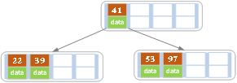
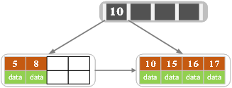

# EXPLAIN


执行计划包含的信息 

 id：id相同，执行顺序由上至下；id不同，id的序号会递增，id值越大优先级越高，越先被执行。

select_type：主要是用于区别普通查询、联合查询、子查询等的复杂查询。

 table：指的就是当前执行的表。

type： 显示的是查询使用了哪种访问类型。

possible_keys：显示可能应用在这张表中的索引。如果为空，没有可能的索引。

key： 实际使用的索引。如果为NULL，则没有使用索引。

key_len：使用的索引的长度。在不损失精确性的情况下，长度越短越好。

 ref：显示索引的哪一列被使用了。

rows：必须检查的用来返回请求数据的行数。

Extra：解析查询的额外信息。

# EXPLAIN注意点

**1. type：显示的是访问类型，是较为重要的一个指标**

​    **常用从好到坏依次是：const > eq_ref > ref > range > index > ALL。一般来说，得保证查询至少达到range级别，最好能达到ref。**

  const：表示通过索引一次就找到了。

​    eq_ref ：唯一性索引扫描，表中只有一条记录与之匹配。常见于主键或唯一索引扫描。

​    ref ：非唯一性索引扫描，返回匹配某个单独值的所有行，可能会找到多个符合条件的行。*

​    range：只检索给定范围的行，这种范围扫描索引比全表扫描要好，因为它只需要开始于索引的某一点，而结束于另一点，不用扫描全部索引。

   index： 索引全扫描。

​    ALL：全表扫描。

**2. Extra：解析查询的额外信息常见说明**

 *只有using index：意思就是索引覆盖，查询的内容可以直接在索引中拿到。*

​    *只有using where：表明虽然用到了索引，但是没有索引覆盖，产生了回表。*

​    *同时有using where和using index：表明用到了索引，索引也覆盖了，using where只是过滤元组，和是否读取数据文件或索引文件没有关系。*

​    ***其它：出现using filesort、using temporary影响系统的性能需要优化。***

# 建索引注意点

1. 选择唯一性索引，能建立唯一索引的建唯一索引。

2. 限制索引的数目，一般不超过5个。

3. 最左前缀匹配原则，mysql会一直向右匹配直到遇到范围查询(>、<、between、like)就停止匹配，比如a=1 and b=2 and c>3 and d=4 如果建立(a,b,c,d)顺序的索引，d是用不到索引的，如果建立(a,b,d,c)的索引则都可以用到，a,b,d的顺序可以任意调整。

4. 选择区分度高的列作为索引。

5. 索引列不能参与计算，否则不能使用到索引。

6. 尽量扩展索引，不要新建索引。

7. 为经常需要排序、分组和联合操作的字段建立索引。

8. 尽量使用前缀来索引，类似VARCHAR(256)、TEXT类型的字段，只检索字段的前面的若干个字符，这样可以提高检索速度。

**9. 数据库多表联查时，左连接保证右表字段索引，右连接保证左表字段索引，内连接保证任一表连接字段索引。**


# sql优化

1.对查询进行优化，要尽量避免全表扫描，首先应考虑在 where 及 order by 涉及的列上建立索引。


2.应尽量避免在 where 子句中对字段进行 null 值判断，否则将导致引擎放弃使用索引而进行全表扫描，小数据量情况下会走索引（并不是绝对的不走索引），如：

```
select id from t where num is null
```

最好不要给数据库留NULL，尽可能的使用 NOT NULL填充数据库.

备注、描述、评论之类的可以设置为 NULL，其他的，最好不要使用NULL。

不要以为 NULL 不需要空间，比如：char(100) 型，在字段建立时，空间就固定了， 不管是否插入值（NULL也包含在内），都是占用 100个字符的空间的，如果是varchar这样的变长字段， null 不占用空间。


可以在num上设置默认值0，确保表中num列没有null值，然后这样查询：

```
select id from t where num = 0
```


3.应尽量避免在 where 子句中使用 != 或 <> 操作符，否则将引擎放弃使用索引而进行全表扫描。

4.应尽量避免在 where 子句中使用 or 来连接条件，如果一个字段有索引，一个字段没有索引，将导致引擎放弃使用索引而进行全表扫描，如：

```
select id from t where num=10 or Name = 'admin'
```

 可以这样查询：

```
select id from t where num = 10
union all
select id from t where Name = 'admin'
```


5.in 和 not in 也要慎用，否则会导致全表扫描，如：

```
select id from t where num in(1,2,3)
```

 对于连续的数值，能用 between 就不要用 in 了：

```
select id from t where num between 1 and 3
```

很多时候用 exists 代替 in 是一个好的选择：

```
select num from a where num in(select num from b)
```

 用下面的语句替换：

```
select num from a where exists(select 1 from b where num=a.num)
```

 

 6.下面的查询也将导致全表扫描：

```
select id from t where name like ‘%abc%’
```

 若要提高效率，可以考虑全文检索。

7.如果在 where 子句中使用参数，也会导致全表扫描。因为SQL只有在运行时才会解析局部变量，但优化程序不能将访问计划的选择推迟到运行时；它必须在编译时进行选择。然 而，如果在编译时建立访问计划，变量的值还是未知的，因而无法作为索引选择的输入项。如下面语句将进行全表扫描：

```
select id from t where num = @num
```

 可以改为强制查询使用索引：

```
select id from t with(index(索引名)) where num = @num
```

 .应尽量避免在 where 子句中对字段进行表达式操作，这将导致引擎放弃使用索引而进行全表扫描。如：

```
select id from t where num/2 = 100
```

 应改为:

```
select id from t where num = 100*2
```


9.应尽量避免在where子句中对字段进行函数操作，这将导致引擎放弃使用索引而进行全表扫描。如：

```
select id from t where substring(name,1,3) = ’abc’       -–name以abc开头的id
select id from t where datediff(day,createdate,’2005-11-30′) = 0    -–‘2005-11-30’    --生成的id
```

 应改为:

```
select id from t where name like 'abc%'
select id from t where createdate >= '2005-11-30' and createdate < '2005-12-1'
```


10.不要在 where 子句中的“=”左边进行函数、算术运算或其他表达式运算，否则系统将可能无法正确使用索引。

11.在使用索引字段作为条件时，如果该索引是复合索引，那么必须使用到该索引中的第一个字段作为条件时才能保证系统使用该索引，否则该索引将不会被使用，并且应尽可能的让字段顺序与索引顺序相一致。

12.不要写一些没有意义的查询，如需要生成一个空表结构：

```
select col1,col2 into #t from t where 1=0
```

 这类代码不会返回任何结果集，但是会消耗系统资源的，应改成这样：
create table #t(…)

13.Update 语句，如果只更改1、2个字段，不要Update全部字段，否则频繁调用会引起明显的性能消耗，同时带来大量日志。

14.对于多张大数据量（这里几百条就算大了）的表JOIN，要先分页再JOIN，否则逻辑读会很高，性能很差。

15.select count(*) from table；这样不带任何条件的count会引起全表扫描，并且没有任何业务意义，是一定要杜绝的。


16.索引并不是越多越好，索引固然可以提高相应的 select 的效率，但同时也降低了 insert 及 update 的效率，因为 insert 或 update 时有可能会重建索引，所以怎样建索引需要慎重考虑，视具体情况而定。一个表的索引数最好不要超过6个，若太多则应考虑一些不常使用到的列上建的索引是否有 必要。

17.应尽可能的避免更新 clustered 索引数据列，因为 clustered 索引数据列的顺序就是表记录的物理存储顺序，一旦该列值改变将导致整个表记录的顺序的调整，会耗费相当大的资源。若应用系统需要频繁更新 clustered 索引数据列，那么需要考虑是否应将该索引建为 clustered 索引。

18.尽量使用数字型字段，若只含数值信息的字段尽量不要设计为字符型，这会降低查询和连接的性能，并会增加存储开销。这是因为引擎在处理查询和连 接时会逐个比较字符串中每一个字符，而对于数字型而言只需要比较一次就够了。

19.尽可能的使用 varchar/nvarchar 代替 char/nchar ，因为首先变长字段存储空间小，可以节省存储空间，其次对于查询来说，在一个相对较小的字段内搜索效率显然要高些。

20.任何地方都不要使用 select * from t ，用具体的字段列表代替“*”，不要返回用不到的任何字段。

21.尽量使用表变量来代替临时表。如果表变量包含大量数据，请注意索引非常有限（只有主键索引）。

\22. 避免频繁创建和删除临时表，以减少系统表资源的消耗。临时表并不是不可使用，适当地使用它们可以使某些例程更有效，例如，当需要重复引用大型表或常用表中的某个数据集时。但是，对于一次性事件， 最好使用导出表。

23.在新建临时表时，如果一次性插入数据量很大，那么可以使用 select into 代替 create table，避免造成大量 log ，以提高速度；如果数据量不大，为了缓和系统表的资源，应先create table，然后insert。

24.如果使用到了临时表，在存储过程的最后务必将所有的临时表显式删除，先 truncate table ，然后 drop table ，这样可以避免系统表的较长时间锁定。

25.尽量避免使用游标，因为游标的效率较差，如果游标操作的数据超过1万行，那么就应该考虑改写。

26.使用基于游标的方法或临时表方法之前，应先寻找基于集的解决方案来解决问题，基于集的方法通常更有效。

27.与临时表一样，游标并不是不可使用。对小型数据集使用 FAST_FORWARD 游标通常要优于其他逐行处理方法，尤其是在必须引用几个表才能获得所需的数据时。在结果集中包括“合计”的例程通常要比使用游标执行的速度快。如果开发时 间允许，基于游标的方法和基于集的方法都可以尝试一下，看哪一种方法的效果更好。

28.在所有的存储过程和触发器的开始处设置 SET NOCOUNT ON ，在结束时设置 SET NOCOUNT OFF 。无需在执行存储过程和触发器的每个语句后向客户端发送 DONE_IN_PROC 消息。

29.尽量避免大事务操作，提高系统并发能力。

30.尽量避免向客户端返回大数据量，若数据量过大，应该考虑相应需求是否合理。

 

**实际案例分析**：拆分大的 DELETE 或INSERT 语句，批量提交SQL语句
　　如果你需要在一个在线的网站上去执行一个大的 DELETE 或 INSERT 查询，你需要非常小心，要避免你的操作让你的整个网站停止相应。因为这两个操作是会锁表的，表一锁住了，别的操作都进不来了。
　　Apache 会有很多的子进程或线程。所以，其工作起来相当有效率，而我们的服务器也不希望有太多的子进程，线程和数据库链接，这是极大的占服务器资源的事情，尤其是内存。
　　如果你把你的表锁上一段时间，比如30秒钟，那么对于一个有很高访问量的站点来说，这30秒所积累的访问进程/线程，数据库链接，打开的文件数，可能不仅仅会让你的WEB服务崩溃，还可能会让你的整台服务器马上挂了。
　　所以，如果你有一个大的处理，你一定把其拆分，使用 LIMIT oracle(rownum),sqlserver(top)条件是一个好的方法。下面是一个mysql示例：


```
while(1){

 　　//每次只做1000条

　　 mysql_query(“delete from logs where log_date <= ’2012-11-01’ limit 1000”);

 　　if(mysql_affected_rows() == 0){

　　 　　//删除完成，退出！
　　 　　break；
　　}

//每次暂停一段时间，释放表让其他进程/线程访问。
usleep(50000)

}
```


# 事务

## MVCC

多版本并发控制，指的就是在使用RC和RR隔离级别的事务，在执行普通select操作时，访问记录版本链的过程；使不同事务的读写、写读操作并发执行，提高系统性能；数据库默认隔离级别：**RR（Repeatable Read，可重复读），MVCC主要适用于Mysql的RC,RR隔离级别**，

## InnoDB存储引擎MVCC的实现策略

### 版本链

- innodb存储引擎，聚簇索引记录中都包含两个必要的隐藏列

- - trx_id：每次对某条记录进行改动时，对会把对应的事务id赋值给trx_id隐藏列；
  - roll_pointer：每次对某条记录进行改动时，这个隐藏列会存一个指针，可以通过这个指针找到该记录修改前的信息；

## readview

- read uncommitted隔离级别事务：直接读取记录的最新版本；

- serializable隔离级别事务：使用加锁的方式来访问记录；

- RC和RR隔离级别事务：需要用到版本链概念，核心问题是如何判断版本链中哪个版本是当前事务可见的？

- readview中四个比较重要的概念：

- - m_ids：表示在生成readview时，当前系统中活跃的读写事务id列表；
  - min_trx_id：表示在生成readview时，当前系统中活跃的读写事务中最小的事务id，也就是m_ids中最小的值；
  - max_trx_id：表示生成readview时，系统中应该分配给下一个事务的id值；
  - creator_trx_id：表示生成该readview的事务的事务id；

- 有了readview，在访问某条记录时，按照以下步骤判断记录的某个版本是否可见

- - 1、如果被访问版本的trx_id，与readview中的creator_trx_id值相同，表明当前事务在访问自己修改过的记录，该版本可以被当前事务访问；

  - 2、如果被访问版本的trx_id，小于readview中的min_trx_id值，表明生成该版本的事务在当前事务生成readview前已经提交，该版本可以被当前事务访问；

  - 3、如果被访问版本的trx_id，大于或等于readview中的max_trx_id值，表明生成该版本的事务在当前事务生成readview后才开启，该版本不可以被当前事务访问；

  - 4、如果被访问版本的trx_id，值在readview的min_trx_id和max_trx_id之间，就需要判断trx_id属性值是不是在m_ids列表中？

  - - 如果在：说明创建readview时生成该版本的事务还是活跃的，该版本不可以被访问
    - 如果不在：说明创建readview时生成该版本的事务已经被提交，该版本可以被访问；

- 生成readview时机

- - RC隔离级别：**每次**读取数据前，都生成一个readview；
  - RR隔离级别：在**第一次读**取数据前，生成一个readview；

## undo和redo

在说明原子性原理之前，首先介绍一下MySQL的事务日志。MySQL的日志有很多种，如二进制日志、错误日志、查询日志、慢查询日志等，此外InnoDB存储引擎还提供了两种事务日志：redo log(重做日志)和undo log(回滚日志)。其中redo log用于保证事务持久性；undo log则是事务原子性和隔离性实现的基础。

undo log是实现原子性的关键，是当事务回滚时能够撤销所有已经成功执行的sql语句。InnoDB实现回滚，靠的是undo log：当事务对数据库进行修改时，InnoDB会生成对应的undo log（undo log中的数据是旧的数据）；如果事务执行失败或调用了rollback，导致事务需要回滚，便可以利用undo log中的信息将数据回滚到修改之前的样子。

undo log属于逻辑日志，它记录的是sql执行相关的信息。当发生回滚时，InnoDB会根据undo log的内容做与之前相反的工作：对于每个insert，回滚时会执行delete；对于每个delete，回滚时会执行insert；对于每个update，回滚时会执行一个相反的update，把数据改回去。

以update操作为例：当事务执行update时，其生成的undo log中会包含被修改行的主键(以便知道修改了哪些行)、修改了哪些列、这些列在修改前后的值等信息，回滚时便可以使用这些信息将数据还原到update之前的状态。

如果第一个修改事务未提交，但第二个事务读取第一个事务中修改的数据，实际上第二个事务读取的是undo log中的数据，这是innodb实现锁的原理。

### 两阶段提交

两阶段提交的意义

```
其问题需要的场景是如何让数据库恢复到半个月内任意一秒的状态？

由于 redo log 和 binlog 是两个独立的逻辑，如果不用两阶段提交，
要么就是先写完 redo log 再写 binlog，或者采用反过来的顺序。

我们看看这两种方式会有什么问题。假设当前 ID=2 的行，字段 c 的
值是 0，再假设执行 update 语句过程中在写完第一个日志后，第二个
日志还没有写完期间发生了 crash，会出现什么情况呢？


先写 redo log 后写 binlog。假设在 redo log 写完，binlog 还没有写
完的时候，MySQL 进程异常重启。由于我们前面说过的，redo log 写完
之后，系统即使崩溃，仍然能够把数据恢复回来，所以恢复后这一行 c 
的值是 1。但是由于 binlog 没写完就 crash 了，这时候 binlog 里面
就没有记录这个语句。因此，之后备份日志的时候，存起来的 binlog 里
面就没有这条语句。然后你会发现，如果需要用这个 binlog 来恢复临时
库的话，由于这个语句的 binlog 丢失，这个临时库就会少了这一次更新，
恢复出来的这一行 c 的值就是 0，与原库的值不同。


先写 binlog 后写 redo log。如果在 binlog 写完之后 crash，由于 redo log 
还没写，崩溃恢复以后这个事务无效，所以这一行 c 的值是 0。但是 binlog 
里面已经记录了“把 c 从 0 改成 1”这个日志。所以，在之后用 binlog 来恢
复的时候就多了一个事务出来，恢复出来的这一行 c 的值就是 1，与原库的值不同

可以看到，如果不使用“两阶段提交”，那么数据库的状态就有可能和用它的日志
恢复出来的库的状态不一致。
```

如何判断binlog和redolog是否达成了一致#

这个知识点可是纯干货！

当MySQL写完redolog并将它标记为prepare状态时，并且会在redolog中记录一个XID，它全局唯一的标识着这个事务。而当你设置`sync_binlog=1`时，做完了上面第一阶段写redolog后，mysql就会对应binlog并且会直接将其刷新到磁盘中。

下图就是磁盘上的row格式的binlog记录。binlog结束的位置上也有一个XID。

只要这个XID和redolog中记录的XID是一致的，MySQL就会认为binlog和redolog逻辑上一致。就上面的场景来说就会commit，而如果仅仅是rodolog中记录了XID，binlog中没有，MySQL就会RollBack

说到恢复，简单聊下MySQL的复制恢复的步骤。

对于活跃的事务，直接回滚
对于redo中是Prepare状态的事务，如果binlog中已记录完成则提交，否则回滚事务


# 原子性

# B和B+树

有了B树，为什么还需要B+树呢？那就要先说下B树的缺点了，人类对于性能的追求是无止境的，B树相比二叉树虽好，但还是存在以下问题：

- 每个节点中既要存索引信息，又要存其对应的数据，如果数据很大，那么当树的体量很大时，每次读到内存中的树的信息就会不太够。
- B树遍历整个树的过程和二叉树本质上是一样的，B树相对二叉树虽然提高了磁盘IO性能，但并没有解决遍历元素效率低下的问题。

针对以上两个问题，B+树诞生了，B+树相比B树，本质上是一样的，区别就在与B+树的所有根节点都不带有任何数据信息，只有索引信息，所有数据信息全部存储在叶子节点里，这样，整个树的每个节点所占的内存空间就变小了，读到内存中的索引信息就会更多一些，相当于减少了磁盘IO次数，问题1就得到了解决。又由B树的性质可以得到，所有叶子节点都会在同一层，B+树会以一个链表的形式将所有叶子节点的信息全部串联起来，这样，想遍历所有数据信息只需要顺序遍历叶子节点就可以了，方便又高效，问题二就得到了解决。不仅如此，B+树还有一个相应的优质特性，就是B+树的查询效率是非常稳定的，因为所有信息都存储在了叶子节点里面，从根节点到所有叶子节点的路径是相同的。

### B+树的优点：

- B+树的磁盘读写代价更低

​          B+的内部结点并没有指向关键字具体信息的指针。因此其内部结点相对B树更小。如果把所有同一内部结点的关键字存放在同一盘块中，那么盘块所能容纳的关键字数量也越多。一次性读入内存中的需要查找的关键字也就越多。相对来说IO读写次数也就降低了。

- B+树的数据信息遍历更加方便

​            B+树只要遍历叶子节点就可以实现整棵树的遍历，而B树不支持这样的操作（或者说效率太低），而且在数据库中基于范围的查询是非常频繁的，所以数据库索引基本采用B+树

- B+树的查询效率更加稳定

​          由于非终结点并不是最终指向文件内容的结点，而只是叶子结点中关键字的索引。所以任何关键字的查找必须走一条从根结点到叶子结点的路。所有关键字查询的路径长度相同，导致每一个数据的查询效率相当。

## B树

### B树的定义 

B树也称B-树,它是一颗多路平衡查找树。我们描述一颗B树时需要指定它的阶数，阶数表示了一个结点最多有多少个孩子结点，一般用字母m表示阶数。当m取2时，就是我们常见的二叉搜索树。

一颗m阶的B树定义如下：

1）每个结点最多有m-1个关键字。

2）根结点最少可以只有1个关键字。

3）非根结点至少有Math.ceil(m/2)-1个关键字。

4）每个结点中的关键字都按照从小到大的顺序排列，每个关键字的左子树中的所有关键字都小于它，而右子树中的所有关键字都大于它。

5）所有叶子结点都位于同一层，或者说根结点到每个叶子结点的长度都相同。


上图是一颗阶数为4的B树。在实际应用中的B树的阶数m都非常大（通常大于100），所以即使存储大量的数据，B树的高度仍然比较小。每个结点中存储了关键字（key）和关键字对应的数据（data），以及孩子结点的指针。**我们将一个key和其对应的data称为一个记录**。**但为了方便描述，除非特别说明，后续文中就用key来代替（key, value）键值对这个整体**。在数据库中我们将B树（和B+树）作为索引结构，可以加快查询速速，此时B树中的key就表示键，而data表示了这个键对应的条目在硬盘上的逻辑地址。

### B树的插入操作

插入操作是指插入一条记录，即（key, value）的键值对。如果B树中已存在需要插入的键值对，则用需要插入的value替换旧的value。若B树不存在这个key,则一定是在叶子结点中进行插入操作。

1）根据要插入的key的值，找到叶子结点并插入。

2）判断当前结点key的个数是否小于等于m-1，若满足则结束，否则进行第3步。

3）以结点中间的key为中心分裂成左右两部分，然后将这个中间的key插入到父结点中，这个key的左子树指向分裂后的左半部分，这个key的右子支指向分裂后的右半部分，然后将当前结点指向父结点，继续进行第3步。

下面以5阶B树为例，介绍B树的插入操作，在5阶B树中，结点最多有4个key,最少有2个key

------

a）在空树中插入39


此时根结点就一个key，此时根结点也是叶子结点

------

b）继续插入22，97和41


根结点此时有4个key

------

c）继续插入53


插入后超过了最大允许的关键字个数4，所以以key值为41为中心进行分裂，结果如下图所示，分裂后当前结点指针指向父结点，满足B树条件，插入操作结束。当阶数m为偶数时，需要分裂时就不存在排序恰好在中间的key，那么我们选择中间位置的前一个key或中间位置的后一个key为中心进行分裂即可。



------

d）依次插入13，21，40，同样会造成分裂，结果如下图所示。


------

e）依次插入30，27, 33 ；36，35，34 ；24，29，结果如下图所示。


------

f）插入key值为26的记录，插入后的结果如下图所示。


当前结点需要以27为中心分裂，并向父结点进位27，然后当前结点指向父结点，结果如下图所示。


进位后导致当前结点（即根结点）也需要分裂，分裂的结果如下图所示。


分裂后当前结点指向新的根，此时无需调整。

------

g）最后再依次插入key为17,28,29,31,32的记录，结果如下图所示。


------

在实现B树的代码中，为了使代码编写更加容易，我们可以将结点中存储记录的数组长度定义为m而非m-1，这样方便底层的结点由于分裂向上层插入一个记录时，上层有多余的位置存储这个记录。同时，每个结点还可以存储它的父结点的引用，这样就不必编写递归程序。

一般来说，对于确定的m和确定类型的记录，结点大小是固定的，无论它实际存储了多少个记录。但是分配固定结点大小的方法会存在浪费的情况，比如key为28,29所在的结点，还有2个key的位置没有使用，但是已经不可能继续在插入任何值了，因为这个结点的前序key是27,后继key是30,所有整数值都用完了。所以如果记录先按key的大小排好序，再插入到B树中，结点的使用率就会很低，最差情况下使用率仅为50%。

## B+树

### B+树的定义


各种资料上B+树的定义各有不同，一种定义方式是关键字个数和孩子结点个数相同。维基百科上所定义的方式，即关键字个数比孩子结点个数小1，这种方式是和B树基本等价的。上图就是一颗阶数为4的B+树。

除此之外B+树还有以下的要求。

1）B+树包含2种类型的结点：内部结点（也称索引结点）和叶子结点。根结点本身即可以是内部结点，也可以是叶子结点。根结点的关键字个数最少可以只有1个。

2）B+树与B树最大的不同是内部结点不保存数据，只用于索引，所有数据（或者说记录）都保存在叶子结点中。

3） m阶B+树表示了内部结点最多有m-1个关键字（或者说内部结点最多有m个子树），阶数m同时限制了叶子结点最多存储m-1个记录。

4）内部结点中的key都按照从小到大的顺序排列，对于内部结点中的一个key，左树中的所有key都**小于**它，右子树中的key都**大于等于**它。叶子结点中的记录也按照key的大小排列。

5）每个叶子结点都存有相邻叶子结点的指针，叶子结点本身依关键字的大小自小而大顺序链接。

### B+树的插入操作

1. 若为空树，创建一个叶子结点，然后将记录插入其中，此时这个叶子结点也是根结点，插入操作结束。

2. 针对叶子类型结点：根据key值找到叶子结点，向这个叶子结点插入记录。插入后，若当前结点key的个数小于等于m-1，则插入结束。否则将这个叶子结点分裂成左右两个叶子结点，左叶子结点包含前m/2个记录，右结点包含剩下的记录，将第m/2+1个记录的key进位到父结点中（父结点一定是索引类型结点），进位到父结点的key左孩子指针向左结点,右孩子指针向右结点。将当前结点的指针指向父结点，然后执行第3步。

3. 针对索引类型结点：若当前结点key的个数小于等于m-1，则插入结束。否则，将这个索引类型结点分裂成两个索引结点，左索引结点包含前(m-1)/2个key，右结点包含m-(m-1)/2个key，将第m/2个key进位到父结点中，进位到父结点的key左孩子指向左结点, 进位到父结点的key右孩子指向右结点。将当前结点的指针指向父结点，然后重复第3步。


下面是一颗5阶B树的插入过程，5阶B数的结点最少2个key，最多4个key。

------

a）空树中插入5


------

b）依次插入8，10，15


------

c）插入16


插入16后超过了关键字的个数限制，所以要进行分裂。在叶子结点分裂时，分裂出来的左结点2个记录，右边3个记录，中间key成为索引结点中的key，分裂后当前结点指向了父结点（根结点）。结果如下图所示。


当然我们还有另一种分裂方式，给左结点3个记录，右结点2个记录，此时索引结点中的key就变为15。

------

d）插入17



------

e）插入18，插入后如下图所示


当前结点的关键字个数大于5，进行分裂。分裂成两个结点，左结点2个记录，右结点3个记录，关键字16进位到父结点（索引类型）中，将当前结点的指针指向父结点。


当前结点的关键字个数满足条件，插入结束。

------

f）插入若干数据后


------

g）在上图中插入7，结果如下图所示 


当前结点的关键字个数超过4，需要分裂。左结点2个记录，右结点3个记录。分裂后关键字7进入到父结点中，将当前结点的指针指向父结点，结果如下图所示。


当前结点的关键字个数超过4，需要继续分裂。左结点2个关键字，右结点2个关键字，关键字16进入到父结点中，将当前结点指向父结点，结果如下图所示。


# 影响mysql原因

#### sql查询速度

80%的原因慢sql；建议explain分析。

#### 磁盘IO

使用SSD，fashionIO。

#### 网络

减少从服务器数量，缓存分级。

#### 硬件：fashionIO

#### 大表

业务表超过1000W条，单表数据文件超过10G，可以在mysql安装目录下查看。

MySQL<5.5建立索引会锁表

修改表结构会锁表

# 二进制日志（binlog）

记录了所有对MySQL的增删改查和对表结构的修改事件（只有执行成功的事件）

三个作用：恢复（删库后的数据恢复），复制。

### 二进制日志格式

查看二级制日志格式：show variables like  'binlog_format';

设置二进制日志格式：set session binlog_format=statement;

查看二进制日志内容：show binlog event in 'mysql_bin.000001';

#### STATEMENT格式

基于段的二级制格式 binlog_format=STATEMENT

##### 优点

- 日志量相对较小，节约磁盘及网络IO；

##### 缺点

- 记录要记录上下文信息
- 可能导致主备数据不一致

#### ROW格式

Row格式可以避免MySQL复制中出现的主从不一致的问题

同一SQL语句修改了10000条数据的情况下

基于段的日志格式只会记录个SQL语句

基于行的日志会有10000条记录分别记录每一行的数据修改。

##### 优点

使MySQL主从复制更安全。

对每一行数据的修改比基于段的复制高效

可以通过分析二进制日志进行恢复数据（误操作导致的数据改变）

##### 缺点

记录日志量较大

binlog_row_image=（full）(MINNIMAL) (NOBlOB)  控制row模式下记录方式

set session binlog_row_image=minimal;

full模式：记录所有列的修改变化（包含未修改的）。

MINNIMAL：只记录修改了列的数据变化。

NOBlOB：没有对text blob列进行修改，不用记录text blob的列的值。

#### MIXED模式

建议使用

- 可以根据SQL语句的格式由系统决定在基于段和基于行的日志格式中进行选择
- 数据量大小由执行的SQL语句

### 复制

#### 基于SQL语句的复制（SBR）

二进制日志使用的是基于statement的格式

##### 优点

生成的日志量少，节约网络IO；

不要求主从数据库表定义完全相同

相比于基于行的复制方式更加灵活

##### 缺点

无法保持主从复制数据一致

对于存储过程，触发器，自定义函数进行的修改也可能造成数据不一致

相比于行的复制方式在从库上执行时需要更多的行锁

#### 基于行的复制（RBR）

二进制日志使用的是基于行日志格式

##### 优点

主从数据一致

减少从服务器锁的使用

##### 缺点

要求主从数据库表结构相同，否则可能导致中断复制

#### 混合模式

根据实际内容在以上两者切换

# 主从复制过程

1、主将变更写入二进制日志

2、从读取主的二进制日志 并写入relay_log（中继日志）中

3、在从上重放relay_log中的日志

基于SQL段的日志是在从库上重新执行记录对的SQL

基于行的复制是在从库上直接应用对数据库行的修改

 ### 配置步骤

配置主数据库服务器

bin_log=mysql-bin

server_id=100

从服务器

bin_log=mysql-bin

server_id=101

relay_log = mysql-relay-bin


# 读写分离

应用层 springboot多数据源+AOP选择数据源实现负载均衡

有一个构思：  一主多从，多个应用服务器的情况下，每个服务器对应着一个从服务器。但所有的服务器的写操作都在主库上操作。


