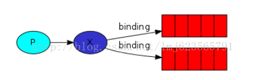
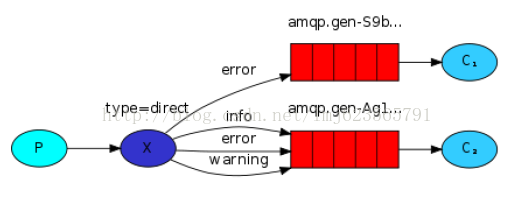
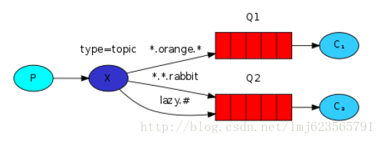

基本概念

RabbitMQ 是信息传输的中间者。本质上，他从生产者（producers）接收消息，转发这些消息给消费者（consumers）.换句话说，他能够按根据你指定的规则进行消息转发、缓冲、和持久化。

### 生产者

Producing意味着无非是发送。一个发送消息的程序是一个producer(生产者)。

### 消费者

Consuming（消费）类似于接收。consumer是基本属于等待接收消息的程序。

### 队列

Queue（队列）类似邮箱。依存于RabbitMQ内部。虽然消息通过RabbitMQ在你的应用中传递，但是它们只能存储在queue中。队列不受任何限制，可以存储任何数量的消息—本质上是一个无限制的缓存。很多producers可以通过同一个队列发送消息，相同的很多consumers可以从同一个队列上接收消息。

### 死信队列

变成了 “死信” 后    被重新投递（publish）到另一个Exchange   该Exchange 就是DLX     然后该Exchange 根据绑定规则 转发到对应的 队列上  监听该队列  就可以重新消费     说白了 就是  没有被消费的消息  换个地方重新被消费

生产者   -->  消息 --> 交换机  --> 队列  --> 变成死信  -->  

DLX交换机 -->队列 --> 消费者

#### 死信队列产生原因

消息被拒绝（basic.reject或basic.nack）并且requeue=false.

消息TTL过期

队列达到最大长度（队列满了，无法再添加数据到mq中）

#### 配置死信队列

- 新建死信队列与死信交换机（就是普通的交换机与队列，routingkey可以设置为#）
- 配置业务队列，绑定到业务交换机上，为业务队列配置死信交换机和路由key也就是配置 arguments.put("x-dead-letter-exchange","自己生命的死信队列名") 
- 消费者监听死信队列并进行消息消费

### 延时队列

延时发送消息可以利用死信队列实现，设置TTL消息，消息过期就会发送到死信队列。TTL就是延时时间

## 转发器

### Fanout

生产者发送消息并带上binding发送到转发器，队列通过binding获取转发器中的消息，消费者监听队列获得消息。

fanout类型转发器特别简单，把所有它介绍到的消息，**广播到所有它所知道的队列**。

RabbitMQ消息模型的核心理念是生产者永远不会直接发送任何消息给队列，一般的情况生产者甚至不知道消息应该发送到哪些队列。相反的，生产者只能发送消息给转发器（Exchange）。转发器是非常简单的，一边接收从生产者发来的消息，另一边把消息推送到队列中。转发器必须清楚的知道消息如何处理它收到的每一条消息。是否应该追加到一个指定的队列？是否应该追加到多个队列？或者是否应该丢弃？这些规则通过转发器的类型进行定义。



### Direct

与Fanout不同，生产者发送消息并带上binding发送到转发器，队列与转发器绑定，**交换器只发送队列感兴趣的消息**。

direct类型的转发器背后的路由转发算法很简单：消息会被推送至绑定键（binding key）和消息发布附带的选择键（routing key）完全匹配的队列。



上图，我们可以看到direct类型的转发器与两个队列绑定。第一个队列与绑定键error绑定，第二个队列与转发器间有三个绑定，一个与绑定键info绑定，另一个与error绑定键绑定,第三个与warning绑定键绑定。
这样的话，当一个消息附带一个选择键（routing key） error发布至转发器将会被导向到上面的队列。消息附带一个选择键（routing key）info或者error和warning将会被导向到第二个队列。

### **Topic** 

发往主题类型的转发器的消息不能随意的设置选择键（routing_key），必须是由点隔开的一系列的标识符组成。标识符可以是任何东西，但是一般都与消息的某些特性相关。一些合法的选择键的例子："stock.usd.nyse", "nyse.vmw","quick.orange.rabbit".你可以定义任何数量的标识符，上限为255个字节。
绑定键和选择键的形式一样。主题类型的转发器背后的逻辑和直接类型的转发器很类似：一个附带特殊的选择键将会被转发到绑定键与之匹配的队列中。需要注意的是：关于绑定键有两种特殊的情况。
*可以匹配一个标识符。
#可以匹配0个或多个标识符。



我们准!备发送关于动物的消息。消息会附加一个选择键包含3个标识符（两个点隔开）。第一个标识符描述动物的速度，第二个标识符描述动物的颜色，第三个标识符描述动物的物种：<speed>.<color>.<species>。
我们创建3个绑定键：Q1与*.orange.*绑定Q2与*.*.rabbit和lazy.#绑定。
可以简单的认为:
Q1对所有的橙色动物感兴趣。
Q2想要知道关于兔子的一切以及关于懒洋洋的动物的一切。
一个附带quick.orange.rabbit的选择键的消息将会被转发到两个队列。附带lazy.orange.elephant的消息也会被转发到两个队列。另一方面quick.orange.fox只会被转发到Q1，lazy.brown.fox将会被转发到Q2。lazy.pink.rabbit虽然与两个绑定键匹配，但是也只会被转发到Q2一次。quick.brown.fox不能与任何绑定键匹配，所以会被丢弃。
如果我们违法我们的约定，发送一个或者四个标识符的选择键，类似：orange，quick.orange.male.rabbit，这些选择键不能与任何绑定键匹配，所以消息将会被丢弃。
另一方面，lazy.orange.male.rabbit，虽然是四个标识符，也可以与lazy.#匹配，从而转发至Q2。
注：主题类型的转发器非常强大，可以实现其他类型的转发器。
当一个队列与绑定键#绑定，将会收到所有的消息，类似fanout类型转发器。
当绑定键中不包含任何#与*时，类似direct类型转发器。

## 消息不丢失

#### **消息应答（message acknowledgments）**

执行一个任务需要花费几秒钟。你可能会担心当一个工作者在执行任务时发生中断。我们上面的代码，一旦RabbitMQ交付了一个信息给消费者，会马上从内存中移除这个信息。在这种情况下，如果杀死正在执行任务的某个工作者，我们会丢失它正在处理的信息。我们也会丢失已经转发给这个工作者且它还未执行的消息。RabbitMQ默认设置消息应答开启。在订阅消息的时候可以指定应答模式,当自动应答等于true的时候，表示当消费者一收到消息就表示消费者收到了消息，消费者收到了消息就会立即从队列中删除。也可以用以下方式配置

```
//自动ACK模式
boolean autoAck = true;
channel.basicConsume(QUEUE_NAME, autoAck, consumer);
```


#### 消息持久化（Message durability）

- 声明队列必须设置持久化 durable 设置为 true.
- 消息推送投递模式必须设置持久化，deliveryMode 设置为 2（持久）。
- 消息已经到达持久化交换器。
- 消息已经到达持久化队列

当RabbitMQ退出或者异常退出，将会丢失所有的队列和信息，除非你告诉它不要丢失。我们需要做两件事来确保信息不会被丢失：我们需要给所有的队列和消息设置持久化的标志。第一， 我们需要确认RabbitMQ永远不会丢失我们的队列。为了这样，我们需要声明它为持久化的。boolean durable = true;第二消息也要持久化，spring使用rabbitmq默认消息为持久化。


## 与Spring Boot配合使用

### 1、加入依赖

```
   <dependency>
            <groupId>org.springframework.boot</groupId>
            <artifactId>spring-boot-starter-amqp</artifactId>
        </dependency>
```

### 2、配置

（1）、yml配置

```yaml
spring：
 rabbitmq:
    host: 127.0.0.1
    port: 5672
    password: guest
    username: guest
    publisher-confirms: true
    publisher-returns: true
```

（2）、配置队列，转发器，一般常用direct模式

```
/**
     * direct模式     *
     * 消息中的路由键（routing key）如果和 Binding 中的 binding key 一致，
     * 交换器就将消息发到对应的队列中。路由键与队列名完全匹配
     */
    @Bean
    public Queue bookOrderQueue() {

        return new Queue(MqConsts.BOOK_ORDER_QUEUE);
    }

    @Bean
    public Queue directQueue2() {
        return new Queue(MqConsts.DIRECT_QUEUE2);
    }

    @Bean
    public DirectExchange directExchange() {
        return new DirectExchange(MqConsts.BOOK_DIRECT_EXCHANGE);
    }

    /**
     * @return queue1接受routingKey1的数据
     */
    @Bean
    public Binding BookOrderQueueBinding() {
        return BindingBuilder.bind(bookOrderQueue()).to(directExchange()).with(MqConsts.BOOK_ORDER_ROUTING_KEY);
    }

    /**
     * @return queue2接受routingKey2的数据
     */
    @Bean
    public Binding directBinding2() {
        return BindingBuilder.bind(directQueue2()).to(directExchange()).with(MqConsts.ROUTING_KEY2);
    }
    }
```

### 3、消息发送

```
 @Autowired
    private RabbitTemplate rabbitTemplate;

    public void send(String json) {
        rabbitTemplate.convertAndSend(RabbitMqConfig.DIRECT_EXCHANGE, "bookOrder", json);
    }

```

第一个参数转发器名，

第二个参数routingKey，转发器会根据这个转发到相应的队列，

第三个参数为数据，一般为json数据

### 4、消息消费

方式一

```
 @RabbitListener(queues = RabbitMqConfig.DIRECT_QUEUE1)
    public void receiveTopic1(String message) throws InterruptedException {
      //以json数据传递消费者把json数据转换为实体类
        List<User> users = (List<User>) JsonUtil.fromJson(message, new TypeReference<List<User>>(){});
         //模拟业务耗时
       Thread.sleep(2000);
       System.out.println("【receiveTopic1监听到消息】" +users);
    }
```

在方法上添加 @RabbitListener注解 ，参数为spring配置中相应的队列。

如果在类上添加@RabbitListener注解，那么就要在方法上添加@RabbitHandler，表示被@RabbitHandler注解修饰的方法都会处理@RabbitListener注解声明的队列里的消息。

方式二

```
 @RabbitListener(
            bindings = @QueueBinding(
                    value = @Queue(value = RabbitMqConfig.DIRECT_QUEUE1,autoDelete = "true",durable = "false"),
                    exchange = @Exchange(value = RabbitMqConfig.DIRECT_EXCHANGE),
                    key = "bookOrder"
            ))
    public void receiveTopic2(String message) {
        List<User> users = (List<User>) JsonUtil.fromJson(message, new TypeReference<List<User>>() {
        });
        System.out.println("【receiveTopic1监听到消息】" + users);
    }
```

不用在spring文件中配置，直接在消费者端声明所有配置。消费者端会建立队列。

**特别注意@QueueBinding属性：**

autoDelete = "true"：

当Queue中的 autoDelete 属性被设置为true时，那么，当消息接收者宕机，关闭后，消息队列则会删除，消息发送者一直发送消息，当消息接收者重新启动恢复正常后，会接收最新的消息，而宕机期间的消息则会丢失，

一般当Queue中的 autoDelete 属性被设置为false时，那么，当消息接收者宕机，关闭后，消息队列不会删除，消息发送者一直发送消息，当消息接收者重新启动恢复正常后，会接收包括宕机期间的消息。

durable = "false" ：表示不持久化

RabbitMQ默认将消息存储在内存中，若RabbitMQ宕机，那么所有数据就会丢失，所以在声明队列的时候可以声明将数据持久化，但是如果已经声明了一个未持久化的队列，那么不能修改，只能将这个队列删除或重新声明一个持久化数据。

，如果想重启之后还存在就要使队列持久化，设置durable = "true" 表示持久化，消息会保存到Erlang自带的Mnesia数据库中，当RabbitMQ重启之后会读取该数据库

### 5、消息ACK

RabbitMQ的消息确认有两种。**SpringBoot默认开启消息确认如果消息消费失败（消费端有异常），消息会一直发送给消费者，除非消费端设置重试次数和手动ACK。**

**一种是消息发送确认**。这种是用来确认生产者将消息发送给交换器，交换器传递给队列的过程中，消息是否成功投递。发送确认分为两步，一是确认是否到达交换器，二是确认是否到达队列。

**第二种是消费接收确认**。这种是确认消费者是否成功消费了队列中的消息。

##### 消费发送确认

###### ConfirmCallback

 通过实现ConfirmCallBack接口，消息发送到交换器**Exchange**后触发回调。

```
  RabbitTemplate rabbitTemplate = new RabbitTemplate(connectionFactory);


        // 消息是否成功发送到Exchange
        rabbitTemplate.setConfirmCallback((correlationData, ack, cause) -> {
            if (ack) {
                String msgId = correlationData.getId();

                //TODO  更改消息数据库中的消息标记状态为已发送
                log.info("消息成功发送到Exchange correlationDataID {}", msgId);
            } else {
                //TODO  更改消息数据库中的消息标记状态为发送失败，定时任务稍后重新发送
                log.info("消息发送到Exchange失败, {}, cause: {}", correlationData, cause);
            }
        });
```

使用该功能需要开启确认，spring-boot中配置如下：

spring.rabbitmq.publisher-confirms = true

###### ReturnCallback

通过实现ReturnCallback接口，如果消息从交换器发送到对应队列失败时触发（比如根据发送消息时指定的routingKey找不到队列时会触发）

```
 // 触发setReturnCallback回调必须设置mandatory=true, 否则Exchange没有找到Queue就会丢弃掉消息, 而不会触发回调
        rabbitTemplate.setMandatory(true);
        // 消息是否从Exchange路由到Queue, 注意: 这是一个失败回调, 只有消息从Exchange路由到Queue失败才会回调这个方法
        rabbitTemplate.setReturnCallback((message, replyCode, replyText, exchange, routingKey) -> {
            Role role = (Role) JsonUtil.fromJson(message.getBody(), new TypeReference<Role>() {
            });
            //TODO 更改消息数据库中的消息标记状态
            log.info("消息从Exchange路由到Queue失败: exchange: {}, route: {}, replyCode: {}, replyText: {}, message: {} ,role:{}", exchange, routingKey, replyCode, replyText, message, role);
        });

        return rabbitTemplate;
    }
```

使用该功能需要开启确认，spring-boot中配置如下：

spring.rabbitmq.publisher-returns = true

##### 消费接收确认

###### 消费段开启消息重试次数，

下面设置为4次，4次以后，消息将会被丢失

```
 rabbitmq:
    host: 127.0.0.1
    port: 5672
    password: guest
    username: guest
    publisher-confirms: true
    publisher-returns: true
     #消息重试
    listener:
      simple:
        retry:
          enabled: true
          max-attempts: 4
          #开启ack
#        acknowledge-mode: manual
#      direct:
#        acknowledge-mode: manual
```

消费端有异常，消息不会给MQ服务ack信息，但消息会被重新消费4次，如果还未被消费，则消息会被丢弃，如果try catch，则消费成功，不会重新消费。

```
@RabbitListener(queues = MqConsts.DIRECT_QUEUE2)
    public void receiveTopic1(String json, Channel channel, Message message) throws IOException {
        System.out.println("【receiveTopic1监听到消息】" + json);
           throw new RuntimeException();
    }
```

###### 开启手动ACK

开启消费端ACK 

```
  rabbitmq:
    host: 127.0.0.1
    port: 5672
    password: guest
    username: guest
    publisher-confirms: true
    publisher-returns: true
     #消息重试
    listener:
      simple:
        retry:
          enabled: true
          max-attempts: 4
          #开启ack
        acknowledge-mode: manual
      direct:
        acknowledge-mode: manual
```

```
//将会导致  入队->消费拒绝并重新入队->消费拒绝并重新入队 的循环
    @RabbitListener(queues = MqConsts.DIRECT_QUEUE2)
    public void receiveTopic1(String json, Channel channel, Message message) throws IOException {

        Role role = (Role) JsonUtil.fromJson(json, Role.class);
        System.out.println(role);
        System.out.println("【receiveTopic1监听到消息】" + json);
        //消费成功返回ACK
        channel.basicAck(message.getMessageProperties().getDeliveryTag(), false);
        try {
            throw new RuntimeException();
        } catch (Exception e) {
            e.printStackTrace();
            //发生异常消息重新入队，也可以返回成功消费ACK
             channel.basicNack(message.getMessageProperties().getDeliveryTag(), false, true);
        }
    }
```

**1、成功确认**

void basicAck(long deliveryTag, boolean multiple) throws IOException;

deliveryTag:该消息的主键

multiple：是否批量. true：将一次性ack所有小于deliveryTag的消息。

消费者成功处理后，调用channel.basicAck(message.getMessageProperties().getDeliveryTag(), false)方法对消息进行确认。

**2、失败确认**

- **void basicNack(long deliveryTag, boolean multiple, boolean requeue)throws IOException;**

deliveryTag:该消息的主键。

multiple：是否批量. true：将一次性拒绝所有小于deliveryTag的消息。

requeue：被拒绝的是否重新入队列。

- **void basicReject(long deliveryTag, boolean requeue) throws IOException;**

deliveryTag:该消息的主键。

requeue：被拒绝的是否重新入队列。

**channel.basicNack 与 channel.basicReject 的区别在于basicNack可以批量拒绝多条消息，而basicReject一次只能拒绝一条消息。**

**3、手动确认模式，消息手动拒绝中如果requeue为true会重新放入队列，但是如果消费者在处理过程中一直抛出异常，会导致入队-》拒绝-》入队的循环**

**处理方法**

第一种方法是根据异常类型来选择是否重新放入队列。

第二种方法是先成功确认，然后通过**channel.basicPublish()**重新发布这个消息。重新发布的消息网上说会放到队列后面，进而不会影响已经进入队列的消息处理。

void basicPublish(String exchange, String routingKey, boolean mandatory, boolean immediate, BasicProperties props, byte[] body)throws IOException;

### 流量削峰

**手动ACK**

在手动ACK前提下消费端限流 ，设置QOS,spring中设置spring.rabbitmq.listener.simple.prefetch=1代表消费者一次只能接受一个消息，如果不ACK则不接收下一条消息，如果没有ACK 则不会进行消费新的消息

### 消息保障100%投递成功

- 保障消息成功发出
- 保障MQ节点的成功接收
- 发送端收到MQ节点（broken）的确认应答
- 完善的消息补偿机制

#### 生产端可靠传递

 消息可靠性传递只能保证消息一定会发送出去，但不保证可能会发送两次的情况，这个时候要在消费端做幂等性操作，防止消息重复消费。

**1、消息入库,对消息状态进行标记**

​       1、业务数据和消息都进行落库

​       2、生产端发送message给Broker

　　3、Broker给Confirm响应返回生产端

　　4、接收到confirm，对message状态更改

　　5、分布式 定时任务获取消息的状态

　　6、如果消息不能成功投递，重新进行发送，记录重发次数

　　7、当重发3次之后，将状态修改，只能人工进行干预

**2、消息延迟投递，做二次确认，回调检查，适合高并发环境，减少写库的次数**

​      1、上游服务首先将业务数据入库，发送message给Broker

　　2、发送第二个延迟确认消息

　　3、下游服务监听消息进行消费

　　4、消息消费成功之后，发送一个确认消费消息

　　5、通过回调服务监听收到消费者的确认消息，消费成功之后，做消息的持久化存储

　　6、回调服务接受到延迟确认消息，会数据库查询是否有这条消息

　　7、如果没有查到这条消息，回调服务通过RPC给一个重新发送命令到上游系统

#### 消费端保障幂等性

首先，无论是RabbitMQ、RocketMQ还是kafka，都有可能出现消息的重复发送，这个是MQ无法保障的，而幂等性是开发或者运维人员需要保证的。在消费端做消息幂等性

##### 可能出现幂等性情况

　   1、可靠性消息投递机制：consumer回复confirm出现网络闪断，producer没有收到ack，定时任务轮询可能就会重新发送消息，这样consumer就会收到两条消息

　　2、MQ Broker与消费端传输消息的过程出现网络抖动

　　3、消费端故障或异常

##### 解决方案

**1、唯一ID+指纹码**

整体实现相对简单，需要进行数据库写入，利用数据库主键去重，使用ID进行分库分表算法路由，从单库的幂等性到多库的幂等性

　　1)  这里唯一ID一般就是业务表的主键，比如商品ID

　　2)  指纹码：每次操作都要生成指纹码，可以用时间戳+业务编号+...组成，目的是保证每次操作都是正常的

​      3）消费消息前先查询唯一ID，如果有，则不消费，如果没有，进行消费，并把唯一ID写如数据库。

​      4）可以分库分表，对ID进行hash路由操作，使同一个ID落入同一个数据库

**整体流程：**

- 需要一个统一ID生成服务，为了保证可靠性，上游服务也要有个本地ID生成服务，然后发送消息给Broker

- 需要ID规则路由组件去监听消息，先入库，如果入库成功，证明没有重复，然后发给下游，如果发现库里面有了这条消息，`就不发给下游` 

**坏处：高并发下有数据库写如的瓶颈**

**2、利用Redis的原子性实现**

Redis的实现性能比较好，而且Redis一般使用集群，不用担心某台机器挂掉了，影响服务。

SETNX命令

存在的问题：

是否要进行数据落库，如果落库的话，怎么保证缓存和storage的一致性、事务，如果不落库，如何设置定时同步策略


